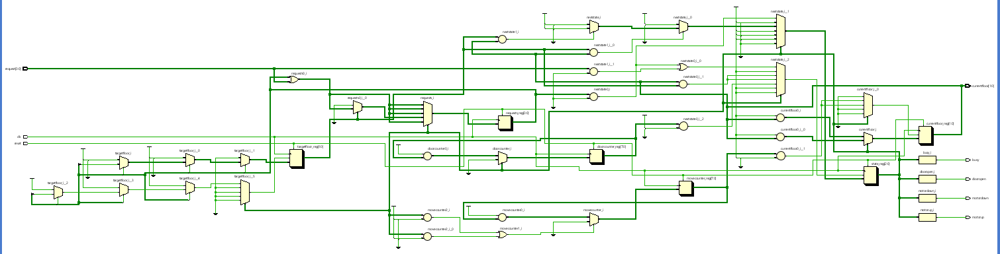

# FPGA-Based 4-Floor Elevator Controller

A synthesizable **4-floor Elevator Controller** designed in **Verilog HDL** using a **Moore Finite State Machine (FSM)** architecture. The controller is intended for FPGA implementation and demonstrates the design of a synchronous digital control system capable of handling multiple floor requests, controlling elevator movement, and managing door operations.


---

# Project Overview

This project implements the control logic of a four-floor elevator. The controller continuously monitors floor requests, determines the appropriate direction of travel, moves the elevator floor-by-floor, opens the door upon reaching the destination, and services pending requests before returning to the idle state.

The design follows a Moore FSM architecture, making the controller modular, predictable, and suitable for FPGA synthesis.

---

# Features

- 4-floor elevator control
- Moore FSM architecture
- Synchronous digital design
- Multiple floor request handling
- Automatic target floor selection
- Upward and downward movement control
- Door timing control
- Busy status indication
- Parameterized movement and door timing
- Synthesizable Verilog RTL
- FPGA-oriented design methodology

---

# System Specifications

| Parameter | Value |
|-----------|-------|
| Language | Verilog HDL |
| Design Style | Register Transfer Level (RTL) |
| Architecture | Moore Finite State Machine |
| Floors | 4 (0–3) |
| Clock | Synchronous |
| Reset | Active-High Asynchronous Reset |
| Target Platform | FPGA |

---

# Input Signals

| Signal | Width | Description |
|---------|------:|-------------|
| `clk` | 1 | System clock |
| `reset` | 1 | Active-high reset signal |
| `request` | 4 | Floor request inputs |

Each bit of the request signal represents a floor.

| Bit | Floor |
|-----|-------|
| request[0] | Floor 0 |
| request[1] | Floor 1 |
| request[2] | Floor 2 |
| request[3] | Floor 3 |

---

# Output Signals

| Signal | Width | Description |
|---------|------:|-------------|
| `motorup` | 1 | Elevator moving upward |
| `motordown` | 1 | Elevator moving downward |
| `dooropen` | 1 | Opens elevator door |
| `busy` | 1 | Indicates elevator is servicing requests |
| `currentfloor` | 2 | Current elevator floor |

---

# Design Parameters

The controller uses configurable timing parameters.

```verilog
parameter DOORTIME = 20;
parameter MOVETIME = 10;
```

- **DOORTIME** defines how long the door remains open.
- **MOVETIME** defines the travel time between adjacent floors.

These values can be modified to simulate different elevator speeds.

---

# Finite State Machine

The controller consists of six states.

| State | Description |
|--------|-------------|
| S0 | Idle |
| S1 | Determine movement direction |
| S2 | Move Up |
| S3 | Move Down |
| S4 | Door Open |
| S5 | Door Close |

---

# Working Principle

1. The controller waits for incoming floor requests.
2. Requests are stored internally.
3. The next target floor is selected.
4. The movement direction is determined.
5. The elevator moves one floor at a time.
6. After reaching the destination, the door opens.
7. The door remains open for the programmed duration.
8. The completed request is cleared.
9. If additional requests exist, the controller services them; otherwise, it returns to the idle state.

---

# Internal Modules

The design is organized into four major sections.

### 1. State Register

Maintains the current state of the finite state machine.

### 2. Next-State Logic

Determines the next state based on the current state and system conditions.

### 3. Output Logic

Generates motor, door, and busy control signals using a Moore FSM implementation.

### 4. Datapath

Responsible for:

- Storing requests
- Selecting target floors
- Updating the current floor
- Clearing completed requests

---

# Request Scheduling

Incoming requests are stored in an internal request register.

The current implementation uses a simple priority-based scheduler where the lowest-numbered pending floor is serviced first.

This scheduling strategy keeps the control logic straightforward and easy to understand.

---

# RTL Schematic

The repository includes the RTL schematic generated after synthesis, providing a hardware-level representation of the Verilog design.

<p align="center">
  
</p>

---

# Project Structure

```
FPGA-Based-Elevator-Controller/
│── elevatorcontroller.v
│── schematic.png
│── README.md
```

---

# Synthesis

The RTL is written using synthesizable Verilog constructs suitable for FPGA implementation.

The design avoids non-synthesizable behavioral constructs and follows standard synchronous digital design practices.

---

# Development Tools

- Verilog HDL
- AMD Vivado Design Suite

---

# Author

**Huzaifa**

Electrical Engineering Student

National University of Sciences and Technology (NUST)


---

# License

This project is released under the MIT License.
